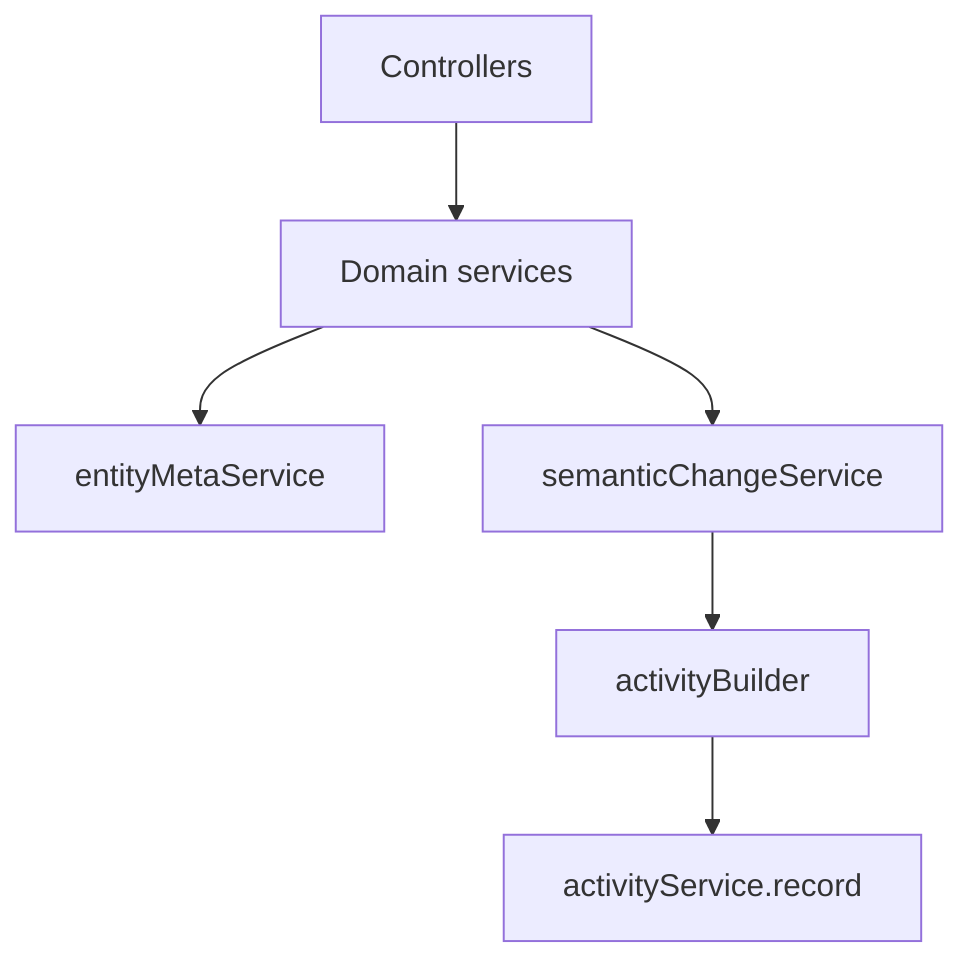

# Activity System — план разработки (v2)

## Цели

- Пользователь видит **кто создал / кто последний раз менял** карточку (product meta header).
- Пользователь видит **жизнь сущности** в ленте (Activity Feed) — narrative history, не forensic dump.
- Архитектура **extensible** (колонки и VARCHAR-поля без жёстких PG enum), реализация **приземлённая** (явные вызовы, без Sequelize hooks / event sourcing / generic `updated`).

## Принципы (зафиксированы до кода)

| Делаем | Не делаем в MVP |
|--------|-----------------|
| Meta + Activity раздельно | Nested supplements history |
| Activity Type Registry (только MVP-типы) | Свободные строки `activity_type` в контроллерах |
| Centralized summary builder | Inline summary в controllers |
| Soft batching при 2+ полях | Generic fallback `updated` |
| `importance`, `source` в схеме | Diff engine, hooks, CQRS, realtime |
| Whitelist по реальным полям домена | Выдуманные status/priority/SLA |

**Расширяемость без лишних enum сейчас:** `activity_type`, `category`, `actor_type`, `source` — VARCHAR + TypeScript registry/constants. Новые значения (comment, ai, linked_oa) добавляются в registry и builder при появлении фичи, без миграции enum.

---

## Текущее состояние (база)

| Сущность | `created_by` | `updated_by` | timestamps |
|----------|--------------|--------------|------------|
| `operational_activities` | есть | нет | есть |
| `incidents` | нет | нет | есть |
| `events` | нет | нет | есть |

Пользователи: `user_profiles` (`external_id`, `display_name`). Имена — только при чтении.

**Домен:** нет status/priority/assignee/SLA — semantic activities только на реальных полях (`direction`, `department_id`, `description`, `is_db`, финансы, `period_from/to`, object types).

**Связи incident ↔ standalone event/OA** — отложить. В MVP: `incident_main_event_updated` (одна запись при изменении блока события на карточке инцидента).

---

## Архитектура write path



**Контроллеры не знают текстов summary** — только передают `before`/`after`, `entityType`, `entityId`, `actor` context (`sub`, `source: ui`).

---

## Шаг 1 — Backend foundation

### 1.1 Миграция `039_entity_meta_and_activity.sql`

**Meta-колонки:** `created_by`, `updated_by` на `incidents`, `events`; `updated_by` на `operational_activities`.

**Таблица `entity_activity`:**

| Колонка | Тип | MVP |
|---------|-----|-----|
| `id` | BIGSERIAL PK | |
| `entity_type` | VARCHAR | `incident`, `event`, `operational_activity` |
| `entity_id` | INTEGER | |
| `activity_type` | VARCHAR | из registry (см. ниже) |
| `category` | VARCHAR | `lifecycle`, `attachment` (+ `relation` для main event) |
| `importance` | VARCHAR DEFAULT `normal` | `low`, `normal`, `high` |
| `actor_type` | VARCHAR | MVP: `user` |
| `actor_external_id` | VARCHAR NULL | Keycloak sub |
| `source` | VARCHAR DEFAULT `ui` | MVP: всегда `ui`; позже `api`, `import`, `integration`, `ai_agent` |
| `occurred_at` | TIMESTAMPTZ | |
| `summary` | TEXT | из summary builder |
| `metadata` | JSONB NULL | `{ field, old, new }` или `{ fields: [...] }` при batch |

**Не добавляем в MVP:** `visibility`, отдельные таблицы snapshot/diff — при необходимости позже через `importance=low` или metadata.

**Индексы:** `(entity_type, entity_id, occurred_at DESC)`.

### 1.2 Activity Type Registry (только MVP)

Файл [app/backend/src/constants/activityTypes.ts](app/backend/src/constants/activityTypes.ts):

```ts
export const ActivityTypes = {
  CREATED: 'created',
  DIRECTION_CHANGED: 'direction_changed',
  DEPARTMENT_CHANGED: 'department_changed',
  DESCRIPTION_CHANGED: 'description_changed',
  IS_DB_CHANGED: 'is_db_changed',
  FINANCIAL_FIELDS_CHANGED: 'financial_fields_changed',
  OBJECT_TYPES_CHANGED: 'object_types_changed',
  PERIOD_CHANGED: 'period_changed',
  FIELDS_BATCH_UPDATED: 'fields_batch_updated',  // soft batching
  INCIDENT_MAIN_EVENT_UPDATED: 'incident_main_event_updated',
  ATTACHMENT_UPLOADED: 'attachment_uploaded',
  ATTACHMENT_DELETED: 'attachment_deleted',
} as const;
```

Типы вроде `comment_added`, `linked_event`, `linked_oa` — **не в registry**, пока нет фичи. Добавление = одна строка в registry + handler в builder.

### 1.3 Summary builder (единственное место для текстов)

**[activitySummary.builder.ts](app/backend/src/constants/activitySummary.builder.ts)** (или `services/activitySummary.builder.ts`)

- `buildSummary(activityType, context)` → русская строка для UI.
- Маппинг field → activityType для одиночных изменений.
- `buildBatchSummary(entityType, changedFields)` → «Изменены основные параметры инцидента» / metadata.fields.
- Label для `direction`, `department_id`, financial group — из существующих label в UI/константах домена, не хардкод в контроллерах.

**Правило:** один стиль формулировок на весь продукт (например: «Направление изменено: ЭБ → ИБ»).

### 1.4 Сервисный pipeline

**[semanticChange.service.ts](app/backend/src/services/semanticChange.service.ts)**

- `detectChanges(entityType, before, after)` → `FieldChange[]` по whitelist.
- Whitelist per entity (реальные поля, см. ниже).
- **Если изменений 0 → пустой массив** (не activity, не generic updated).

**[activityBuilder.service.ts](app/backend/src/services/activityBuilder.service.ts)**

- `buildActivitiesFromChanges(entityType, entityId, changes, context)` → `RecordActivityInput[]`.
- **Soft batching:** если `changes.length >= 2` (порог конфиг, default 2) → **одна** activity `FIELDS_BATCH_UPDATED`, category `lifecycle`, importance `normal`, metadata `{ fields: [{ field, old, new, activityType? }] }`.
- Если 1 change → одна semantic activity с конкретным `activity_type`.
- Назначает `category`, `importance` по таблице defaults (created → high, attachment → normal, field change → normal).

**[activity.service.ts](app/backend/src/services/activity.service.ts)** — только persistence + list.

**[author.service.ts](app/backend/src/services/author.service.ts)** — resolve `display_name`.

**[entityMeta.service.ts](app/backend/src/services/entityMeta.service.ts)** — `applyCreateMeta` / `applyUpdateMeta` / `buildMetaDto`.

### 1.5 Whitelist MVP (реальные поля)

**incident:** `direction`, `department_id`, `description`, `is_db`, financial fields (группа → `FINANCIAL_FIELDS_CHANGED` если >1 фин. поля в одном save), `object_type_ids`.

**event:** `date`, `description`, `is_db`, ключевые boolean-флаги расследований (можно batch), financial fields.

**operational_activity:** `direction`, `department_id`, `period_from`, `period_to`, `description` — не все 80+ count-полей в v1.

**incident main event block:** отдельная проверка struct `event` до/после → `INCIDENT_MAIN_EVENT_UPDATED` (одна запись, не diff по supplement).

### 1.6 Политика «без мусора»

- **Нет generic `updated`** — если whitelist пуст, activity не пишем (meta `updated_by` всё равно обновляется).
- Не писать activity на no-op save (deep equal before/after).
- Не писать на CRUD additionally/addresses/persons в MVP B.
- Attachment: одна activity на файл (`ATTACHMENT_UPLOADED` / `DELETED`), importance `normal`.

### 1.7 Интеграция write path

| Место | Meta | Activity (через builder) |
|-------|------|--------------------------|
| create/update incident | yes | `CREATED`; detectChanges + batch; optional `INCIDENT_MAIN_EVENT_UPDATED` |
| create/update event | yes | `CREATED`; detectChanges + batch |
| create/update OA | yes | `CREATED`; detectChanges + batch |
| upload/delete incident (event) attachments | — | `ATTACHMENT_*`, source `ui` |

Context для builder: `{ actorType: 'user', actorExternalId: sub, source: 'ui' }`.

### 1.8 API read path

GET entity — поле `meta` с resolved authors.

```
GET /incidents/:id/activity
GET /events/:id/activity
GET /operational-activities/:id/activity
```

**DTO item:**

```ts
{
  id, activity_type, category, importance, summary, occurred_at,
  actor_type, source,
  actor: { external_id, display_name } | null,
  metadata?: object
}
```

Фильтр query (позже в UI): `importance=high`, `categories=lifecycle,attachment`.

---

## Шаг 2 — Frontend

- **EntityMetaHeader** — product-style под заголовком (Linear/Jira).
- **EntityActivityTimeline** — Timeline, группировка по дню, иконка по `category`, визуальный акцент для `importance: high`.
- Вкладки: **Обзор** | **История** на IncidentView, EventView, OperationalActivityView.
- Опционально: filter «Только важное» (`importance != low`) — если появятся low-записи позже.

---

## Шаг 3 — После MVP (схема готова, код не пишем)

| Расширение | Как подключить |
|------------|----------------|
| Nested supplements | новые ActivityTypes + builder handlers |
| Comments | `comment_added`, category `comment` |
| AI / agent | `actor_type: agent`, `source: ai_agent`, category `ai` |
| Cross-entity links | `linked_event`, `linked_oa` |
| Collapse noise | `importance: low` + UI filter |
| AI digest | query activity + LLM |
| Notifications | подписка на feed |

---

## Правила в коде (краткий ADR)

1. Summary только в `activitySummary.builder`.
2. Activity types только из `ActivityTypes` registry.
3. Write path: `semanticChange` → `activityBuilder` → `activityService.record`.
4. Нет Sequelize hooks.
5. Нет activity, если нет semantic changes.
6. Meta columns — только `external_id`.
7. `source` и `importance` в каждой записи (defaults в builder).

---

## PR-порядок

1. **PR1** — migration, models, registry, builder, activity/author/entityMeta services.
2. **PR2** — meta + create/update для 3 сущностей + soft batching.
3. **PR3** — attachments + GET activity + meta в GET entity.
4. **PR4** — frontend MetaHeader + History tab.

Оценка: **5–8 дней** (1 dev).

---

## Риски

| Риск | Митигация |
|------|-----------|
| Шум от множества полей | Soft batching ≥2 изменений |
| Пустой save без изменений | deep compare, 0 activities |
| Разные формулировки summary | единый builder |
| Legacy без created_by | UI «—» |
| Дубли при retry | idempotency в metadata — позже |
